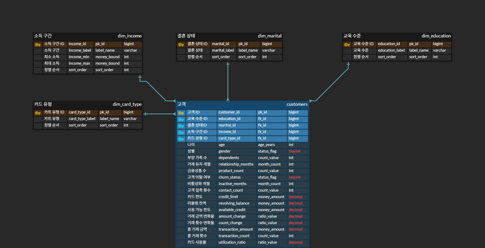

# SKN-2nd-1Team
---
## 💳머신러닝 기반 신용카드 가입 고객 이탈 예측 시스템

---
### 📅개발 기간 
#### 2026.03.04 ~ 2026.03.16
---

### 👋🏻팀 소개
#### **Team EXODIA**
<table align="center">
  <tr>
    <td align="center" width="160px"></td>
    <td align="center" width="160px"></td>
    <td align="center" width="160px"></td>
    <td align="center" width="160px"></td>
    <td align="center" width="160px"></td>
    <td align="center" width="160px"></td>
  </tr>
  <tr>
    <td align="center"><b>서민혁</b></td>
    <td align="center"><b>유동현</b></td>
    <td align="center"><b>윤정연</b></td>
    <td align="center"><b>전종혁</b></td>
    <td align="center"><b>정영일</b></td>
    <td align="center"><b>조동휘</b></td>
  </tr>
  <tr>
    <td align="center">PM/FULL STACK</td>
    <td align="center">FRONT</td>
    <td align="center">FRONT</td>
    <td align="center">DB/BACK</td>
    <td align="center">FRONT</td>
    <td align="center">DB/BACK</td>
  </tr>
  <tr>
    <td align="center"></td>
    <td align="center"></td>
    <td align="center"></td>
    <td align="center"></td>
    <td align="center"></td>
    <td align="center"></td>
  </tr>
</table>

---

## 1. 프로젝트 개요📑
### 1-1. 프로젝트 개요 (Project Overview)
본 프로젝트는 카드 고객 데이터를 기반으로 **고객 활동 패턴과 카드 이탈(Churn) 간의 관계**를 분석하고, 이를 바탕으로 고객 세그먼트별 맞춤형 카드 상품 전략을 도출하는 것을 목표로 합니다. 현재 카드 산업은 신규 고객 확보 비용이 매우 높기 때문에, 기존 고객의 이탈을 방지하고 장기적인 고객 가치를 유지하는 것이 최우선 과제로 인식되고 있습니다.

동적인 행동 데이터를 기반으로 **이탈의 주요 선행 신호**를 도출하여 고객 세그먼트별 맞춤형 카드 상품 라인업 개편과 리텐션 전략을 제안했습니다. 본 프로젝트는 단순한 데이터 분석을 넘어, 고객 행동 데이터 기반의 실효성 있는 금융 상품 전략을 수립함으로써 카드 산업 내 데이터 활용의 새로운 가능성을 탐색하는 것을 목표로 합니다.

### 1-2. 문제 정의
**높은 유지보수 중요성:** 카드 산업 특성상 신규 고객 확보 비용(CAC)이 매우 높아, 기존 고객의 이탈(Churn) 방지가 핵심 비즈니스 과제입니다.

**이탈 징후 파악의 한계:** 고객마다 거래 빈도, 결제 금액, 한도 활용도 등 사용 패턴이 크게 달라 일원화된 잣대로 이탈을 예측하기 어렵습니다.

**해결 과제:** 고객의 복잡한 행동 차이 중 어떤 특정 패턴이 이탈의 결정적 신호로 작용하는지 명확히 규명할 필요가 있습니다.

---

## 2. 🖥️화면 구현
**분석 대시보드 + 모델별 확률**

  

**전략 보고서**

  

**데이터 분석 결과 페이지**

  

---
## 3. 분석 목표📌
본 프로젝트는 단순한 '카드 사용 감소 = 이탈'이라는 평면적인 공식을 넘어, 고객이 처한 **맥락**을 데이터로 증명하고 이해하는 것을 중심으로 하여 다음 세가지 목표를 달성하고자 합니다.

1. **'미사용 기간'의 입체적 재해석:**    
비활성 기간을 단일한 잣대로 평가하지 않습니다. 고객이 보유한 카드 등급, 연령대, 그리고 이용 중인 금융 상품의 개수를 복합적으로 고려합니다. 이를 통해 동일한 미이용 기간이라도 고객의 소비 성향과 카드 보유 구조(주거래 vs 서브)에 따라 이탈 위험도가 어떻게 달라지는지 다각도로 해석합니다.

2. **행동 변화 기반의 진짜 이탈 시그널 포착:**    
단순한 변수 간의 정적인 차이가 아니라, **거래 감소 -> 카드 사용 감소 -> 비활성 고객 -> 이탈**라는 동적인 흐름에 집중합니다. 특정 카드 등급이나 세그먼트에서 이탈 직전에 공통적으로 나타나는 치명적이고 결정적인 선행 신호가 무엇인지 실제 데이터로 규명합니다.

3. **맥락 기반의 맞춤형 상품 및 리텐션 전략 도출:**    
도출된 인사이트를 바탕으로 천편일률적인 마케팅이 아닌, 타겟 집단의 특성(예: 소액 다결제 vs 고액 소결제)에 딱 맞는 실효성 있는 카드 상품 라인업 개편 및 고객 유지 전략을 제안합니다.

---
## 4. 데이터 소개 및 데이터 베이스 설계🪄

### Kaggle datasets
https://www.kaggle.com/datasets/sakshigoyal7/credit-card-customers

### ERD(Feature Table)

  

---

## 5. 분석 방법🔎
1. **탐색적 데이터 분석 (EDA):**   
Kaggle에서 제공하는 데이터셋을 사용하여 단순 통계 확인을 넘어, 이탈 고객과 유지 고객 간의 행동 패턴(거래 횟수, 거래 금액, 비활성 기간 등) 차이를 시각화하고 세그먼트별 특징을 도출했습니다.

2. **데이터 전처리 (Data Preprocessing):**   
머신러닝 모델의 성능을 극대화하기 위해 결측치 및 이상치를 처리하고, 범주형 변수 인코딩과 스케일링을 진행했습니다. (특히, 유지 고객과 이탈 고객 간의 클래스 불균형 문제를 해결하기 위한 가중치/샘플링 기법을 적용했습니다.)

3. **머신러닝 모델링 및 성능 비교:**   
고객 이탈 여부를 빠르고 정확하게 예측하기 위해, 6명의 팀원이 각각 머신러닝 모델을 구현하고 성능을 다각도로 비교했습니다.
특히 신용카드 이탈 데이터 특유의 '클래스 불균형(Class Imbalance)' 문제를 극복하고, 향후 Streamlit 기반의 웹 서비스 배포 환경까지 고려하여 아래와 같이 6가지 모델 라인업을 구성했습니다.

- Logistic Regression: 연산이 매우 빠르고 변수 해석력이 뛰어난 선형 모델로, 전체 예측 성능의 '하한선(Baseline)'을 설정했습니다.

- XGBoost (XGB): 정형 데이터 분석에 강력한 부스팅(Boosting) 모델로, 정교한 잔차 학습을 통해 타 모델들과 성능을 비교하는 핵심 기준점이 되었습니다.

- LightGBM (LGBM): 리프 중심 트리 분할 방식을 통해 압도적인 학습 속도와 가벼운 용량을 자랑하며, 리소스가 제한된 배포 환경에 최적화된 성능을 구현했습니다.

- HistGradientBoosting: Scikit-learn 환경에서 대용량 데이터를 고속으로 처리하기 위해 도입했으며, 전처리 의존도를 낮추고 빠른 학습을 진행했습니다.

- EasyEnsemble: 압도적으로 많은 유지 고객 데이터에 모델이 편향되는 것을 막기 위해 도입한 '불균형 데이터 특화 모델'로, 숨어있는 이탈 고객을 찾아내는 능력(Recall)을 극대화했습니다.

4. **변수 중요도 파악 및 비즈니스 전략 도출 (Insight & Strategy):**   
단순히 예측 정확도를 높이는 데 그치지 않고, 최종 선정된 모델이 이탈을 판단할 때 가장 중요하게 작용한 핵심 변수를 추출했습니다.
이렇게 데이터 알고리즘이 찾아낸 '결정적 이탈 시그널(거래 횟수 감소, 고객센터 접촉 등)'을 바탕으로, 앞서 정의한 고객 세그먼트별 특성에 딱 맞는 실효성 있는 리텐션(고객 유지) 마케팅 전략과 맞춤형 카드 상품 라인업을 수립했습니다.

---

## 6. 주요 분석 결과💡
전체 고객 중 약 15%가 이탈하는 것으로 나타났으며, 무작위 타겟 마케팅보다는 이탈 위험군 방어가 훨씬 효율적임을 확인했습니다. 데이터 탐색 결과, **카드 이탈은 고객의 우발적 단절이 아닌, 점진적인 행동 변화에 의해 발생한다**는 결론을 도출했습니다.

1. **이탈은 '갑작스러운 사건'이 아닌 '점진적 과정'**
   * **거래량 급감**: 유지 고객의 연간 거래 횟수 중앙값은 약 70회인 반면, 이탈 고객은 약 43회로 **뚜렷한 감소(약 25~30회 차이)**를 보입니다.
   * **사용률 추락**: 이탈 고객의 대다수는 한 번에 카드를 해지하는 것이 아니라, 신용한도 대비 카드 사용률을 **0~20%대까지 서서히 줄여나간 뒤** 최종 이탈하는 패턴을 보입니다.

2. **'누구(Who)'인지보다 '어떻게(How)' 쓰는지가 핵심**
   * 나이, 학력, 소득, 가입 기간 등 고객 특성과 이탈간의 상관관계는 유의미하지 않았습니다. *(데이터의 주 고객층은 연소득 $40K 이하의 대중적인 타겟임이 확인됨)*
   * 반면, **거래 횟수(-0.37), 거래 증가율(-0.29)** 등 실제 카드 사용 행동 지표가 이탈을 예측하는 압도적인 요인임이 입증되었습니다.

3. **고객센터 연락은 강력한 '이탈 전조 증상'**
   * 비활성 기간이 길어지는 것과 더불어, 최근 12개월 내 **고객센터 접촉 횟수(Contacts_Count)가 늘어날수록 이탈 가능성이 상승(+0.20)**합니다.
   * 이는 혜택 불만, 연회비 혹은 해지 관련 문의가 이탈의 직접적인 시그널로 작용함을 의미합니다.

🎯 핵심 이탈 예측 변수

[절대적 사용량]

매우 중요: Total_Trans_Ct (연간 총 거래 횟수)

매우 중요: Total_Trans_Amt (연간 총 거래 금액)

중요: Avg_Utilization_Ratio (평균 신용한도 대비 사용률)

[행동의 변화 흐름]

Total_Ct_Chng_Q4_Q1 (1분기 대비 4분기 거래량 증감률)

[강력한 위험 신호]

Months_Inactive_12_mon (최근 12개월 내 비활성 개월 수)

Contacts_Count_12_mon (최근 12개월 내 고객센터 연락 횟수)

---

## 7. 인사이트 및 전략 제안⭐
앞서 도출된 분석 결과에 따르면, 고객의 이탈은 어느 날 갑자기 일어나는 우발적 사건이 아니라 **'결제 빈도의 뚜렷한 감소'** 그리고 **'고객센터 문의 증가'**라는 명확한 전조 증상을 동반하는 점진적인 과정이었습니다.

따라서 본 프로젝트는 고객의 카드 이탈 전조 증상인 '사용 감소 흐름'을 사전에 끊어내기 위해, 실제 행동 패턴(How)에 직접 개입하여 사용 습관을 재고정하고 고객 생애 가치(LTV)를 극대화하는 것을 핵심 방향으로 설정했습니다. 이를 실현하고자 이용 가치 상승을 위한 **'업셀 구조'**와 결제 장벽 완화를 위한 **'행동 기반 구조'**를 결합한 데이터 기반 맞춤형 카드 라인업 전략을 수립하여, 이탈률 하락과 수익성 제고를 동시에 달성하고자 합니다.

#### 1. 리워드 기반 카드 라인업 (고객 가치 상승 & 업셀링 전략)
고객의 현재 이용 수준에 맞춰 혜택을 제공하고, 점진적으로 상위 카드로의 전환(업셀링)을 유도하여 고객 생애 가치(LTV)를 극대화합니다.

| 콘셉트 | 목적 | 혜택 골자 | 가격 / 조건 | 자격 기준 / (게이팅) | 리스크 통제 | KPI |
| :--- | :--- | :--- | :--- | :--- | :--- | :--- |
| **Entry** | 고객 활성화 | 첫 결제 보너스, 자동납부 혜택, 웰컴 포인트 | 저 / 무연회비, 웰컴 혜택 | 신규 / 저이용 고객 | 낮은 초기 한도, 사용 모니터링 | 30일 활성화율 |
| **Cashback** | 일상 소비 카테고리 고정 | 생활 카테고리 할인 / 캐시백 | 실적 조건 + 월 혜택 캡 | 안정적 이용 패턴 고객 | 혜택 캡, 제휴 비용 분담 | 월 이용 횟수 |
| **Points** | 이용액 확대 / 업셀 | 기본 포인트 적립 + 선택 카테고리 추가 적립 | 실적 조건 상향, 적립 캡 | 일정 이용액 이상 고객 | 오퍼 과다 지급 방지 | 이용액 증가 |
| **Premium** | 핵심 고객 유지 | 여행 / 라운지 / 다이닝 혜택 | 고연회비 + 선택 혜택 | 고이용 / 고가치 고객 | 쿠폰형 혜택 구조 | 갱신율 / ARPU / 이용액 |

#### 2. 행동 기반 카드 라인업 (결제 장벽 완화 & 관계 확장 전략)
고객의 구체적인 소비 행동과 금융 니즈를 타겟팅하여 카드사의 가맹점 수수료 외 추가적인 금융 수익을 창출합니다.

| 콘셉트 | 목적 | 혜택 골자 | 가격 / 조건 | 자격 기준 / (게이팅) | 리스크 통제 | KPI |
| :--- | :--- | :--- | :--- | :--- | :--- | :--- |
| **Co-brand** | 선호 기반 소비 확대 | 항공 마일리지 / 브랜드 할인 | 제휴 연회비 구조 | 브랜드 충성 고객 확보 | 제휴 정산 관리 | 제휴 이용 비중 |
| **Installment** | 고액 결제 장벽 완화 | 무 / 저이자 할부 | 할부 기간 / 업종별 조건 | 고액 결제 고객 | 업종별 한도 관리 | 할부 전환율 |
| **Revolving** | 상환 유연성 제공 | 부분 결제 / 상환 옵션 | 조건부 금리 | 일정 신용도 이상 | 이용률 / 연체 관리 | 리볼빙 이용률 |
| **Bundle / Family** | 고객 관계 확장 | 가족 / 구독 / 자동납부 혜택 | 번들 혜택 구조 | 다상품 이용 고객 | 혜택 누수 방지 | 상품 보유 수 증가 |

#### 3. 고객 세그먼트별 매칭 전략
앞서 구성한 리워드 및 행동 기반 카드 라인업을 각 고객군의 특성과 이용 패턴에 맞춰 매칭하여, 초기 활성화부터 고가치 고객 유지까지 단계별 이탈 방어 전략을 실행합니다.

| Segment | 주요 상품 전략 | 전략 목적 | 카드 상품 유형 |
| :--- | :--- | :--- | :--- |
| **Dormant** | Entry | 초기 카드 사용 활성화 | Entry |
| **Casual** | Cashback | 생활 소비 카드 고정 | Cashback |
| **Active** | Points / Co-brand | 이용액 확대 및 제휴 소비 유도 | Points / Co-brand |
| **Premium** | Premium | 고가치 고객 유지 | Premium |
| **High utilization** | Revolving | 고사용 고객 결제 부담 완화 및 상환 유연성 제공 | Revolving |

---

## 8. 기술 스택🛠️

### **Data Pipeline & Backend**
  

### **Data Analysis & Machine Learning**
 

### **UI / UX**
 

### **Environment & Infrastructure**
 

### **Collaboration**
  

---

## 9. 결론
🚀 기대 효과   
본 프로젝트는 머신러닝 알고리즘을 통해 고객의 '조용한 이탈 시그널'을 사전에 포착하고, 이를 실제 비즈니스 전략으로 연결하는 엔드투엔드(End-to-End) 파이프라인을 구축해 본 것에 큰 의의가 있습니다. 제안된 **'세그먼트별 맞춤형 카드 라인업 전략'**이 도입될 경우 다음과 같은 성과를 기대할 수 있습니다.

- 고객 생애 가치(LTV) 보존 및 수수료 방어:   
 리워드 기반 라인업(Entry → Cashback → Premium)을 통해 고객의 일상 소비를 자사 카드로 고정시켜 이탈을 방어하고, 안정적인 가맹점 수수료 수익을 확보할 수 있습니다.

- 핵심 금융 수익 극대화:   
 행동 기반 라인업(Installment, Revolving)을 통해 고액 결제 부담을 느끼는 위험군 고객에게 상환 유연성을 제공함으로써, 연체 리스크를 관리하는 동시에 카드사의 주요 수익원인 이자 수익을 극대화하는 선순환 구조를 완성합니다.

🏁 결론    
본 프로젝트는 5개의 다양한 머신러닝 모델을 직접 학습하고 비교 분석하여, 고객 정보를 입력하면 실시간으로 이탈 확률(%)을 확인할 수 있는 예측 시스템을 구현해 냈습니다. 이는 단순히 모델의 '예측 정확도'를 높이는 기술적 성취에만 머물지 않고, 우리가 배운 데이터 기술을 실제 비즈니스 문제 해결에 어떻게 적용할 것인가를 치열하게 고민해 본 시간이었습니다.

우리는 구축된 예측 모델과 데이터 분석을 통해, 고객의 이탈이 어느 날 갑자기 일어나는 우발적 변심이 아니라 '거래 빈도 감소'와 '비활성 기간 증가'라는 명확하고 점진적인 시그널을 동반한다는 사실을 데이터로 입증했습니다. 즉, 머신러닝 알고리즘을 활용해 단순한 확률 계산을 넘어 고객 행동 이면에 숨겨진 맥락을 짚어내고자 노력했습니다.

결론적으로 이번 프로젝트는 머신러닝 모델로 이탈률을 예측해보고, 그 결과를 바탕으로 세그먼트별 고객 전략을 직접 고민해 본 의미 있는 시도였습니다. 비록 마스킹된 데이터를 활용한 실험이었지만, 데이터 분석이 어떻게 실제 서비스 아이디어로 연결될 수 있는지 그 가능성을 직접 체감해 볼 수 있었던 값진 경험이었습니다.

⚠️ 한계점 및 향후 과제   
본 프로젝트는 데이터 기반의 유의미한 이탈 방어 전략을 도출해냈으나, 데이터의 특성과 분석 환경에 따른 아래와 같은 한계점이 존재하며 이를 향후 과제로 남겨두고 있습니다.

- 실제 금융 환경과의 간극 (마스킹 데이터의 한계):     
본 프로젝트에 사용된 데이터셋은 비식별화(Masking) 처리된 오픈 데이터입니다. 따라서 도출된 임계치나 전략을 실제 카드사의 비즈니스 환경에 그대로 적용하기에는 한계가 있으며, 실무 도입 시 실제 고객 데이터를 활용한 추가 검증 및 미세 조정(Calibration) 과정이 필수적입니다.

- 결측치(Unknown) 보간 및 고도화 작업의 진행:     
현재 고객의 인구통계학적 특성 중 소득(Income)과 학력(Education) 피처에 존재하는 'Unknown' 값들을 단순히 삭제하지 않고, 머신러닝을 통해 유의미한 값으로 예측하여 채워 넣는 작업을 진행 중입니다.

해당 결측치 예측 모델링이 최종 완료되면, 앞서 유의미하지 않다고 판단되었던 '고객 특성' 변수들이 이탈에 미치는 잠재적 영향을 조금 더 정교하게 재평가할 수 있을 것으로 기대합니다.

## 10. 팀원 회고
<table style="width: 100%; border-collapse: collapse; border: 1px solid #ddd; margin-bottom: 30px;">
    <thead>
        <tr style="background-color: #f8f9fa;">
            <th style="width: 15%; border: 1px solid #ddd; padding: 10px;">대상자</th>
            <th style="width: 15%; border: 1px solid #ddd; padding: 10px;">작성자</th>
            <th style="border: 1px solid #ddd; padding: 10px;">회고 내용</th>
        </tr>
    </thead>
    <tbody>
        <tr>
            <td rowspan="5" style="text-align: center; font-weight: bold; border: 1px solid #ddd;"></td>
            <td style="text-align: center; border: 1px solid #ddd;"></td>
            <td style="border: 1px solid #ddd; padding: 10px;"></td>
        </tr>
        <tr>
            <td style="text-align: center; border: 1px solid #ddd;"></td>
            <td style="border: 1px solid #ddd; padding: 10px;"></td>
        </tr>
        <tr>
            <td style="text-align: center; border: 1px solid #ddd;"></td>
            <td style="border: 1px solid #ddd; padding: 10px;"></td>
        </tr>
        <tr>
            <td style="text-align: center; border: 1px solid #ddd;"></td>
            <td style="border: 1px solid #ddd; padding: 10px;"></td>
        </tr>
        <tr>
            <td style="text-align: center; border: 1px solid #ddd;"></td>
            <td style="border: 1px solid #ddd; padding: 10px;"></td>
        </tr>
    </tbody>
</table>
<table style="width: 100%; border-collapse: collapse; border: 1px solid #ddd; margin-bottom: 30px;">
    <thead>
        <tr style="background-color: #f8f9fa;">
            <th style="width: 15%; border: 1px solid #ddd; padding: 10px;">대상자</th>
            <th style="width: 15%; border: 1px solid #ddd; padding: 10px;">작성자</th>
            <th style="border: 1px solid #ddd; padding: 10px;">회고 내용</th>
        </tr>
    </thead>
    <tbody>
        <tr>
            <td rowspan="5" style="text-align: center; font-weight: bold; border: 1px solid #ddd;"></td>
            <td style="text-align: center; border: 1px solid #ddd;"></td>
            <td style="border: 1px solid #ddd; padding: 10px;"></td>
        </tr>
        <tr>
            <td style="text-align: center; border: 1px solid #ddd;"></td>
            <td style="border: 1px solid #ddd; padding: 10px;"></td>
        </tr>
        <tr>
            <td style="text-align: center; border: 1px solid #ddd;"></td>
            <td style="border: 1px solid #ddd; padding: 10px;"></td>
        </tr>
        <tr>
            <td style="text-align: center; border: 1px solid #ddd;"></td>
            <td style="border: 1px solid #ddd; padding: 10px;"></td>
        </tr>
        <tr>
            <td style="text-align: center; border: 1px solid #ddd;"></td>
            <td style="border: 1px solid #ddd; padding: 10px;"></td>
        </tr>
    </tbody>
</table>
<table style="width: 100%; border-collapse: collapse; border: 1px solid #ddd; margin-bottom: 30px;">
    <thead>
        <tr style="background-color: #f8f9fa;">
            <th style="width: 15%; border: 1px solid #ddd; padding: 10px;">대상자</th>
            <th style="width: 15%; border: 1px solid #ddd; padding: 10px;">작성자</th>
            <th style="border: 1px solid #ddd; padding: 10px;">회고 내용</th>
        </tr>
    </thead>
    <tbody>
        <tr>
            <td rowspan="5" style="text-align: center; font-weight: bold; border: 1px solid #ddd;"></td>
            <td style="text-align: center; border: 1px solid #ddd;"></td>
            <td style="border: 1px solid #ddd; padding: 10px;"></td>
        </tr>
        <tr>
            <td style="text-align: center; border: 1px solid #ddd;"></td>
            <td style="border: 1px solid #ddd; padding: 10px;"></td>
        </tr>
        <tr>
            <td style="text-align: center; border: 1px solid #ddd;"></td>
            <td style="border: 1px solid #ddd; padding: 10px;"></td>
        </tr>
        <tr>
            <td style="text-align: center; border: 1px solid #ddd;"></td>
            <td style="border: 1px solid #ddd; padding: 10px;"></td>
        </tr>
        <tr>
            <td style="text-align: center; border: 1px solid #ddd;"></td>
            <td style="border: 1px solid #ddd; padding: 10px;"></td>
        </tr>
    </tbody>
</table>
<table style="width: 100%; border-collapse: collapse; border: 1px solid #ddd; margin-bottom: 30px;">
    <thead>
        <tr style="background-color: #f8f9fa;">
            <th style="width: 15%; border: 1px solid #ddd; padding: 10px;">대상자</th>
            <th style="width: 15%; border: 1px solid #ddd; padding: 10px;">작성자</th>
            <th style="border: 1px solid #ddd; padding: 10px;">회고 내용</th>
        </tr>
    </thead>
    <tbody>
        <tr>
            <td rowspan="5" style="text-align: center; font-weight: bold; border: 1px solid #ddd;"></td>
            <td style="text-align: center; border: 1px solid #ddd;"></td>
            <td style="border: 1px solid #ddd; padding: 10px;"></td>
        </tr>
        <tr>
            <td style="text-align: center; border: 1px solid #ddd;"></td>
            <td style="border: 1px solid #ddd; padding: 10px;"></td>
        </tr>
        <tr>
            <td style="text-align: center; border: 1px solid #ddd;"></td>
            <td style="border: 1px solid #ddd; padding: 10px;"></td>
        </tr>
        <tr>
            <td style="text-align: center; border: 1px solid #ddd;"></td>
            <td style="border: 1px solid #ddd; padding: 10px;"></td>
        </tr>
        <tr>
            <td style="text-align: center; border: 1px solid #ddd;"></td>
            <td style="border: 1px solid #ddd; padding: 10px;"></td>
        </tr>
    </tbody>
</table>
<table style="width: 100%; border-collapse: collapse; border: 1px solid #ddd; margin-bottom: 30px;">
    <thead>
        <tr style="background-color: #f8f9fa;">
            <th style="width: 15%; border: 1px solid #ddd; padding: 10px;">대상자</th>
            <th style="width: 15%; border: 1px solid #ddd; padding: 10px;">작성자</th>
            <th style="border: 1px solid #ddd; padding: 10px;">회고 내용</th>
        </tr>
    </thead>
    <tbody>
        <tr>
            <td rowspan="5" style="text-align: center; font-weight: bold; border: 1px solid #ddd;"></td>
            <td style="text-align: center; border: 1px solid #ddd;"></td>
            <td style="border: 1px solid #ddd; padding: 10px;"></td>
        </tr>
        <tr>
            <td style="text-align: center; border: 1px solid #ddd;"></td>
            <td style="border: 1px solid #ddd; padding: 10px;"></td>
        </tr>
        <tr>
            <td style="text-align: center; border: 1px solid #ddd;"></td>
            <td style="border: 1px solid #ddd; padding: 10px;"></td>
        </tr>
        <tr>
            <td style="text-align: center; border: 1px solid #ddd;"></td>
            <td style="border: 1px solid #ddd; padding: 10px;"></td>
        </tr>
        <tr>
            <td style="text-align: center; border: 1px solid #ddd;"></td>
            <td style="border: 1px solid #ddd; padding: 10px;"></td>
        </tr>
    </tbody>
</table>
<table style="width: 100%; border-collapse: collapse; border: 1px solid #ddd; margin-bottom: 30px;">
    <thead>
        <tr style="background-color: #f8f9fa;">
            <th style="width: 15%; border: 1px solid #ddd; padding: 10px;">대상자</th>
            <th style="width: 15%; border: 1px solid #ddd; padding: 10px;">작성자</th>
            <th style="border: 1px solid #ddd; padding: 10px;">회고 내용</th>
        </tr>
    </thead>
    <tbody>
        <tr>
            <td rowspan="5" style="text-align: center; font-weight: bold; border: 1px solid #ddd;"></td>
            <td style="text-align: center; border: 1px solid #ddd;"></td>
            <td style="border: 1px solid #ddd; padding: 10px;"></td>
        </tr>
        <tr>
            <td style="text-align: center; border: 1px solid #ddd;"></td>
            <td style="border: 1px solid #ddd; padding: 10px;"></td>
        </tr>
        <tr>
            <td style="text-align: center; border: 1px solid #ddd;"></td>
            <td style="border: 1px solid #ddd; padding: 10px;"></td>
        </tr>
        <tr>
            <td style="text-align: center; border: 1px solid #ddd;"></td>
            <td style="border: 1px solid #ddd; padding: 10px;"></td>
        </tr>
        <tr>
            <td style="text-align: center; border: 1px solid #ddd;"></td>
            <td style="border: 1px solid #ddd; padding: 10px;"></td>
        </tr>
    </tbody>
</table>
